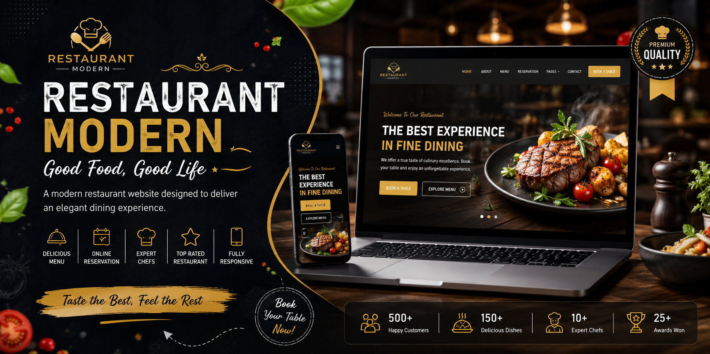
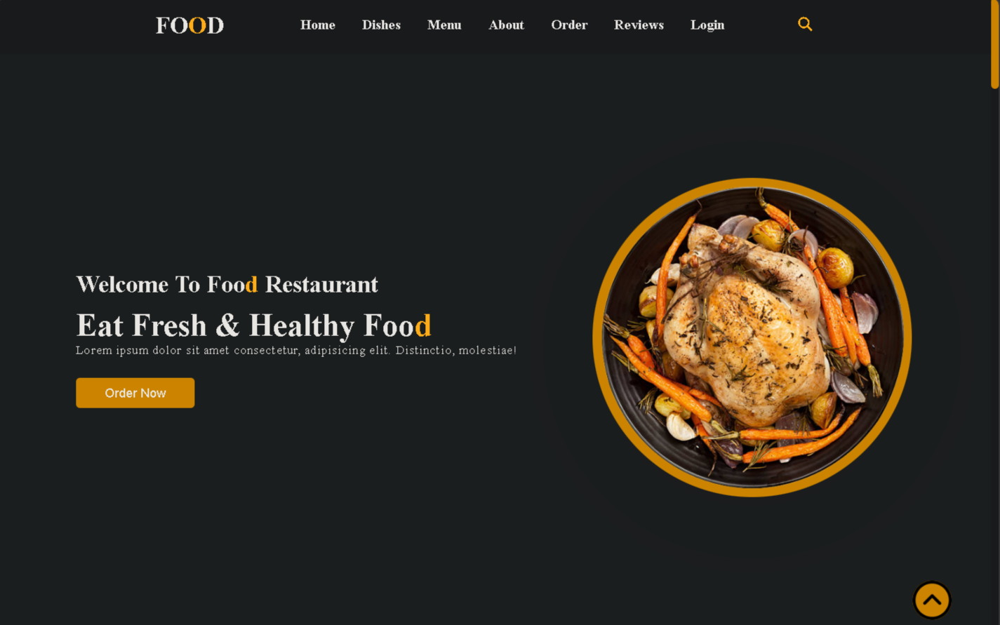
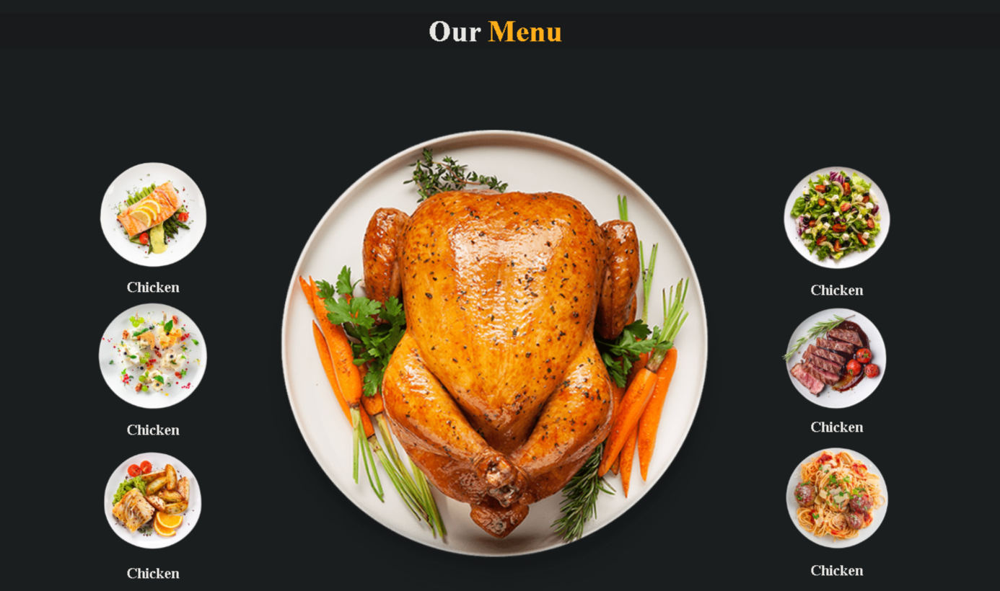
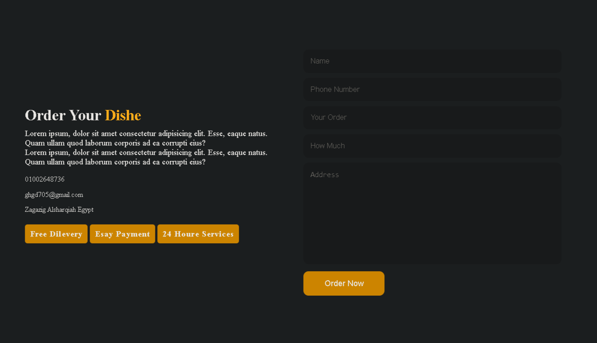
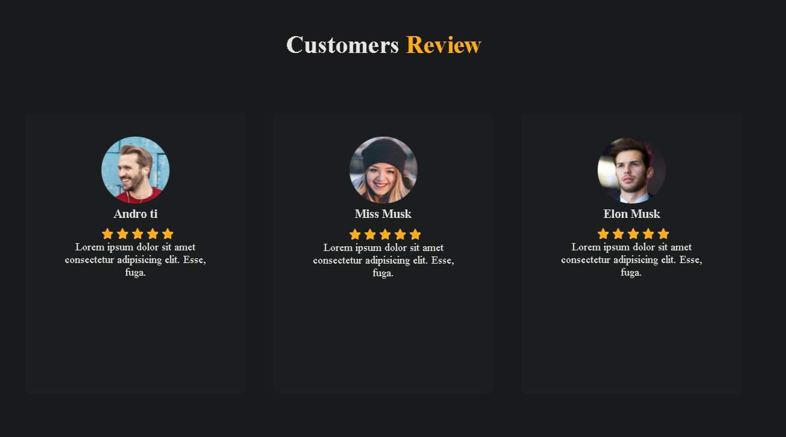
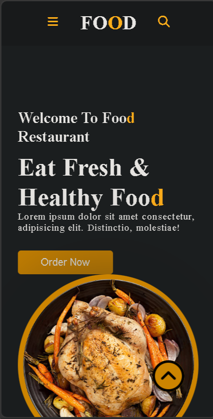

<div align="center">

# 🍽️ Restaurant Modern

### Modern Responsive Restaurant Landing Page

<p align="center">

</p>

<p align="center">


</p>

<p align="center">
A modern restaurant landing page designed with elegant visuals, responsive layouts, and a seamless dining experience.
</p>

</div>

---

# 📖 Overview

Restaurant Modern is a responsive restaurant website built using **HTML5, CSS3, and JavaScript**.

The project delivers a clean and elegant interface that showcases featured dishes, restaurant services, chef recommendations, customer testimonials, and an online reservation section. It is optimized for desktop, tablet, and mobile devices.

---

# ✨ Features

* 🍽️ Elegant restaurant landing page
* 📖 Interactive food menu
* 📅 Online reservation section
* 👨‍🍳 Featured chefs
* ⭐ Customer testimonials
* 📱 Fully responsive layout
* ✨ Smooth scrolling animations
* 🚀 Fast loading performance
* 💻 Cross-browser compatibility

---

# 🛠 Tech Stack

### Frontend

* HTML5
* CSS3
* JavaScript

### Design

* Responsive Design
* CSS Animations
* Mobile First

---

# 📂 Project Structure

```text
Restaurant-Modern/

│
├── css/
├── js/
├── images/
│   ├── banner.png
│   ├── logo.png
│   ├── hero.png
│   ├── menu.png
│   ├── reservation.png
│   ├── testimonials.png
│   └── mobile.png
│
├── index.html
└── README.md
```

---

# 🚀 Getting Started

Clone the repository

```bash
git clone https://github.com/Ahmred0000/rectorant_git.git
```

Navigate to the project folder

```bash
cd rectorant_git
```

Open

```text
index.html
```

or run it using **Live Server**.

---

# 📸 Screenshots

## 🏠 Hero Section



---

## 🍕 Food Menu



---

## 📅 Reservation Section



---

## ⭐ Customer Testimonials



---

## 📱 Mobile Responsive View



---

# 🌐 Live Demo

🔗 https://restorant-website-ten.vercel.app/

---

# 🎯 Highlights

* Modern UI
* Responsive Design
* Interactive Navigation
* Restaurant Menu
* Reservation Section
* Customer Reviews
* Mobile Friendly
* Clean Code Structure

---

# 🔮 Future Improvements

* Online Food Ordering
* Payment Gateway Integration
* Restaurant Dashboard
* Multi-language Support
* Google Maps Integration
* Dark Mode
* Table Availability Checker
* Backend API Integration

---

# 🤝 Contributing

Contributions are welcome!

Feel free to fork the repository and submit a Pull Request.

---

# 📄 License

MIT License

---

# 👨‍💻 Author

**Ahmed Ashraf**

GitHub: https://github.com/Ahmred0000

---

<div align="center">

### ⭐ If you like this project, don't forget to leave a Star!

</div>
